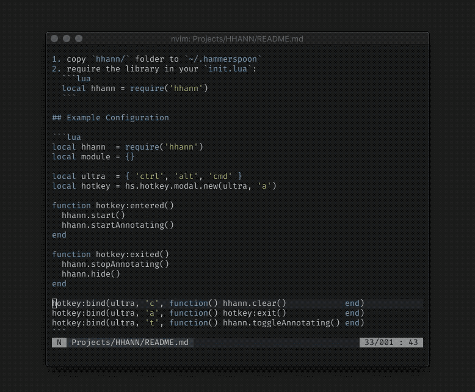

# HHANN
## Hackable Hammerspoon Screen Annotator

<p align="center">
  
</p>

## Setup

1. copy `hhann/` folder to `~/.hammerspoon`
2. require the library in your `init.lua`:
  ```lua
  local hhann = require('hhann')
  ```

## Example Configuration

```lua
local hhann  = require('hhann')
local module = {}

local ultra  = { 'ctrl', 'alt', 'cmd' }
local hotkey = hs.hotkey.modal.new(ultra, 'a')

function hotkey:entered()
  hhann.start()
  hhann.startAnnotating()
end

function hotkey:exited()
  hhann.stopAnnotating()
  hhann.hide()
end

hotkey:bind(ultra, 'c', function() hhann.clear()            end)
hotkey:bind(ultra, 'a', function() hotkey:exit()            end)
hotkey:bind(ultra, 't', function() hhann.toggleAnnotating() end)
```

Hit `ctrl + cmd + alt + a` to enter `hhann` mode, in that mode:
- hold left mouse button to draw
- hit `ctrl + cmd + alt + c` to clear screen
- hit `ctrl + cmd + alt + t` to toggle drawing on/off
- hit `ctrl + cmd + alt + a` to exit

